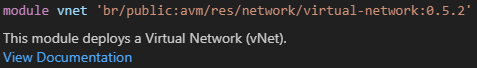
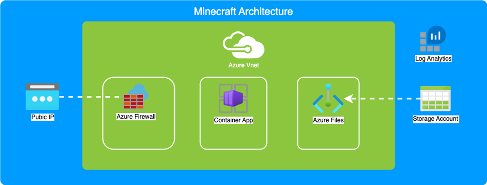

# LAB310: Infra-as-Code based migrations with Azure Verified Modules

Welcome to the bicep repository for LAB310: Infra-as-Code based migrations with Azure Verified Modules

In this repository you will find the content to get started with the deployment under the lab folder. You should use the `sample.main.bicep` to get started with your deployment. The samples look like as follows:

```bicep
module vnet 'br/public:avm/res/network/virtual-network:0.x.x' = {

}
```
**tasks**

- You should update the version to the appropiate version
- You should complete all of the required parameters for the resource deployment


## Tips
- Remember to use `ctrl+space` to bring up intellisense
- hover over the 'freindly name' of the resource (e.g vnet) for a link to the documentation:



## Scenario

- Contoso wants to migrate its LoB application to Azure
- Re-factor the app to run using cloud-native services
- A container + persistent storage
- Implement well-architected reliability and security best-practices
- App is isolated with dedicated ingress/egress

### Target Architecture


### Requirements

- Use Azure Verified Modules
- Use Managed Identities
- Private Endpoints must be utilised for connectivity
- Vnet Integration for Container Apps
- Azure Firewall should be used as the cental ingress/egress point
- Minecraft image used should be `itzg/docker-minecraft-server`

## Deployment Commands

To deploy your resources to the azure subscription within the lab, you can use your own commands or some quickstarts are provided below:

### Create the Resource group

```bash
az login
az group create -n 'lab310-rg'
```

### Create the Resources using Deployment Stacks

```bash
cd <Enter location of Directory holding main.bicep>
az login
az stack group create -n 'lab310stack01' -g 'lab310-rg' --template-file .\main.bicep --dm none --aou detachAll --yes
```
